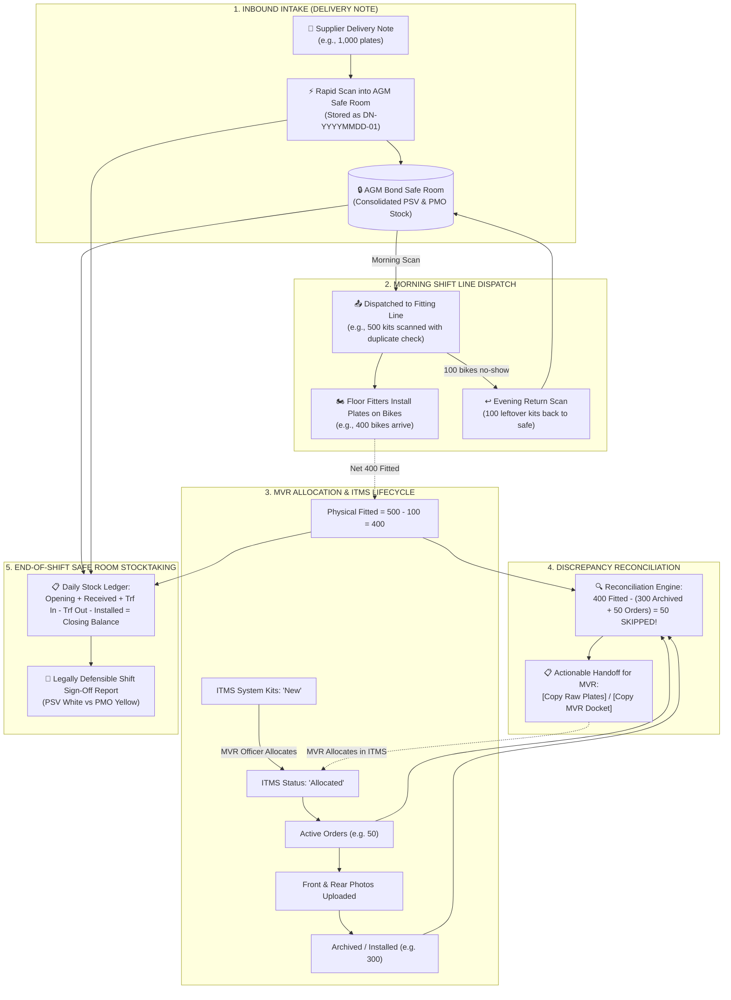

# AGM Bonded Warehouse: Operational Architecture & Implementation Roadmap

## 1. Executive Summary & Purpose

At the **AGM Bonded Warehouse**, high-security digital number plates and telematics kits (carrying RFID chips, QR codes, and GPS trackers) are governed by strict state security, customs, and Ministry regulations. Unaccounted inventory or erroneous reporting carries severe personal and criminal liability for warehouse keepers, team leaders, and fitters.

This system provides an airtight, dual-track operational control platform that addresses two intrinsically linked challenges using a single shared dataset:
1. **Physical Safe Room Inventory Control**: Managing delivery note intakes, safe room storage, morning line dispatches, evening uninstalled returns, and end-of-shift closing balances.
2. **MVR System Allocation Discrepancy Finder**: Instantly identifying the exact license plates physically fitted on motorcycles/vehicles that the MVR officer skipped allocating in the ITMS system, providing 1-click handoff dockets for immediate resolution.

---

## 2. Core Operational Workflow



---

## 3. Detailed Component Specifications

### Track A: Delivery Notes Storage & Safe Room Intake
* **Reference Standard**: All delivery notes are date-anchored with sequential daily counters:
  * Pattern: `DN-YYYYMMDD-01`, `DN-YYYYMMDD-02`, `DN-YYYYMMDD-03`
  * Paper Reference Field: Stores the supplier's printed delivery note number (e.g., `DN-88492`).
  * Supplier: Factory / Central Depot.
  * Category: Public White (PSV) or Private Yellow (PMO).
* **Storage & Evidence**:
  * Each delivery note records its total plate count and the exact array of scanned registration numbers.
  * Optional attachment: Front photo of the physical paper delivery note saved into the Evidence Vault (`media/vault/delivery_notes/`).
  * Permanent Historical Lookup: Team leaders can browse, inspect, and verify past delivery notes by date.

### Track B: Morning Line Dispatch & Evening Returns
* **Morning Dispatch (Line Out)**:
  * Before fitment begins, the team leader scans all kits leaving the safe room (e.g., 500 plates).
  * Rapid USB barcode/QR scanner wedge automatically strips prefixes (`IK-`, `PO-`), checks Ugandan syntax, and rejects duplicates in real-time.
  * Live badge updates: `[Staged: 500 plates]`.
* **Evening Returns (Line Return)**:
  * Uninstalled plates brought back from the floor are scanned directly into the Return Bin.
  * Mandatory reason logging:
    * `BIKE_NO_SHOW` (Owner did not show up)
    * `DEFECTIVE_PLATE` (Misprinted, damaged, bad stamp)
    * `CANCELLED_ORDER` (Customer cancelled fitment)
    * `LINE_ROLLOVER` (Shift ended before completion)
  * Returned plates are restored to the safe room stock and immediately subtracted from the floor liability.

### Track C: Real-Time MVR Allocation Discrepancy Finder
* **The Core Equation**:
  $$\text{Physically Fitted on Floor} = \text{Dispatched Scans} - \text{Returned Scans}$$
  $$\text{Accounted in ITMS} = \text{Archived Orders (Today)} + \text{Active Orders (Today)}$$
  $$\mathbf{MVR\ Skipped\ Plates} = \text{Physically Fitted} - \text{Accounted in ITMS}$$
* **Handoff Actions**:
  1. **`[📋 Copy Raw Plates]`**:
     Copies pure multi-line uppercase plate numbers to the clipboard:
     ```text
     UMA711PW
     UMA993PW
     UMA764PW
     ```
     Enables the MVR officer to instantly paste into ITMS search or batch allocation forms.
  2. **`[📑 Copy MVR Docket]`**:
     Copies a formal shift handoff docket with administrative context:
     ```text
     ====================================================
     AGM BONDED WAREHOUSE - MVR ALLOCATION PENDING DOCKET
     ====================================================
     Date: 30/09/2026 | Shift Date Suffix: 300926
     Dispatched: 500 | Returned: 100 | Fitted: 400
     ITMS Accounted: 350 (Archive: 300, Active Orders: 50)
     ----------------------------------------------------
     UNALLOCATED PLATES REQUIRING MVR ALLOCATION (50):
     1. UMA711PW  [PSV] - Dispatched 08:14
     2. UMA993PW  [PSV] - Dispatched 08:15
     ...
     ====================================================
     ```
* **Self-Healing Resolution**:
  When MVR allocates the plates, the next background sync pulls the newly created orders. The system automatically reconciles them, moves them out of the discrepancy table, and decreases the discrepancy count to **0**.

### Track D: Daily Safe Room Stock-Taking & Closing Balance
* **The Master Reconciliation Balance**:
  $$\text{Closing Stock} = \text{Opening} + \text{Received (Delivery Notes)} + \text{Transfer In} - \text{Transfer Out} - \text{Installed (Orders + Archive)} - \text{Defective/Issues}$$
* **Category Separation**:
  * Tracked identically across **Public White (PSV)**, **Private Yellow (PMO)**, and **Total Combined (Bond)**.
  * Scheduled Shift Target vs. Actual Installed variance: $\text{Variance} = \text{Installed} - \text{Scheduled}$.
* **Audit Defense**:
  Provides an exportable CSV/printable shift ledger proving that every plate received on a delivery note is accounted for: either sitting safely in the safe room, installed on a bike, returned, or transferred.

---

## 4. Implementation Roadmap

### Phase 1: Storage for Delivery Notes (Backend & Service)
- [x] Base `StockDelivery` and `StockDeliveryItem` models exist.
- [x] Add `paper_note_reference` (paper invoice/manifest number) to `StockDelivery`.
- [x] Add `delivery_note_reference` auto-generator: `DN-YYYYMMDD-XX`.
- [x] Add optional photo capture field `delivery_note_image` in Evidence Vault.
- [x] Implement `get_delivery_notes_summary(target_date_suffix)` service.

### Phase 2: Dual MVR Copy Actions & Discrepancy UI
- [x] Add `[📋 Copy Raw Plates]` (clean multi-line text) and `[📑 Copy MVR Docket]` (formatted text) to TUI `ReportsPane`.
- [x] Add matching dual copy buttons to Web Dashboard (`tab_reports.html` / `tab_reports.js`).
- [x] Expose REST API endpoint `/api/stock/mvr-docket/` returning both raw and formatted text.

### Phase 3: Delivery Notes Archive & Safe Room Browser in TUI
- [x] In `StockManagerModal` Tab 3 (Inbound Delivery):
  - Add Delivery Note # generator and paper note input.
  - Add a sub-table displaying today's received delivery notes with kit counts and timestamps.
- [x] Wire rapid scan to immediately stage items under the active Delivery Note.

### Phase 4: Shift End Reconciliation & Sign-Off Wizard
- [x] Automated verification matching physical safe counts with digital closing balances.
- [x] One-click export of the daily shift closeout CSV for supervisor review.
- [x] Verification of all test suites (stock monitoring, regression, event handlers).

### Phase 5: High-Capacity Deep Crawling & 3-Hour Safe Room Daemon
- [x] Scaled crawler default up to 100 pages (min 100 pages = 2,000+ installation kits) for comprehensive safe-room catalog synchronization.
- [x] Polite crawler pacing (0.35s sleep + jitter), HTTP 429 `Retry-After` parsing, exponential backoff, and circuit breaker.
- [x] Implemented atomic chunked bulk upserts (`bulk_create` / `bulk_update` in chunks of 200 items) preventing SQLite / PostgreSQL locking.
- [x] Asynchronous `MorningKitSyncDaemon` running on a 3-hour interval (10,800s) with 10-minute cooldown window.

### Phase 6: Floor Dispatch Discrepancy Isolation & Vision OCR Decoupling
- [x] Strictly isolated safe-room warehouse stock (`InstallationKit` status "New") from the Floor Unallocated plates table.
- [x] Eliminated camera OCR / vision detections from the stock discrepancy scale to prevent OCR text fragments and noise from polluting daily ledgers.
- [x] Ground truth floor liability is strictly anchored to physical barcode/plate scans (`StockDispatchScan`).

### Phase 7: Set-Aside Pre-Dispatch Verification Workflow
- [x] Pre-dispatch validation against synchronized safe-room ITMS stock.
- [x] Automatic set-aside blocking for kits not registered in ITMS, preventing unregistered plates from reaching assembly fitters.
- [x] Substitution workflow: Replace with valid in-stock kit while unlisted plate awaits ITMS Stock Transfer Officer confirmation.
