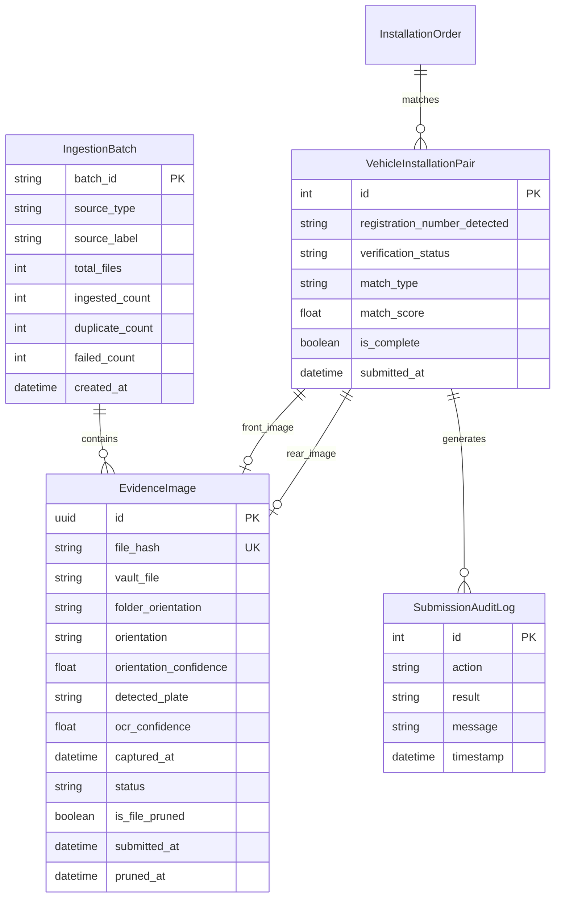

# Evidence Vault File & Folder Lifecycle, Database Schema & Storage Maintenance

This document provides a comprehensive technical reference on how files and folders are created, partitioned, enhanced, tracked in the database, and cleaned up across the ITMS Photo Verification System.

---

## 1. Core Architecture & Design Principles

```
  RAW CAPTURE SOURCES                         EVIDENCE VAULT (IMMUTABLE)
┌─────────────────────────┐                  ┌──────────────────────────────────────────────┐
│ Phone Export / SD Card  │                  │  media/vault/YYYY-MM-DD/                     │
│ ├── front/ (Front Mud)  │ ─── Ingestion ──►│  └── batch_HHMMSS_<id>/                      │
│ └── rear/  (Taillight)  │     (SHA-256)    │      ├── <uuid-1>.jpg  [Front - Enhanced]    │
└─────────────────────────┘                  │      └── <uuid-2>.jpg  [Rear  - Enhanced]    │
┌─────────────────────────┐                  └──────────────────────┬───────────────────────┘
│ Web UI / REST API       │                                         │
│ ├── front_photos        │                                         ▼
│ └── rear_photos         │                  ┌──────────────────────────────────────────────┐
└─────────────────────────┘                  │  Vision Pipeline (Plate Localizer & OCR)    │
                                             │  media/crops/YYYY-MM-DD/batch_.../           │
                                             │  └── <uuid-1>_crop.jpg                       │
                                             └──────────────────────────────────────────────┘
```

1. **Forensic Immutability**:
   - Raw photographic evidence is copied into the secure `media/vault/` directory with a unique **UUIDv4** filename to prevent path collisions and sanitize untrusted client filenames.
2. **Cryptographic Deduplication**:
   - Every file undergoes a streaming **SHA-256** hash calculation (`hash_file_path` or `hash_stream`).
   - If the exact hash already exists in `EvidenceImage.file_hash`, the disk write is bypassed and the record is tagged as `DUPLICATE_SKIPPED`.
3. **Dual-Classified Spatial Tracking**:
   - Motorcycle plate verification requires matching one Front photo with one Rear photo.
   - The system tracks folder-level and stream-level orientation (`FRONT` vs. `REAR`), propagating ground truth tags through database records to pair-matching and audit logs.
4. **Separation of Evidence and Transients**:
   - Vault files (`media/vault/`) are long-term evidence subject to retention policies.
   - Plate crops (`media/crops/`) and debug visualization files are transient intermediate assets cleaned by routine storage maintenance.

---

## 2. Directory Layout & File Hierarchy

The filesystem is organized into timestamped, structured partitions:

```
media/
├── vault/                                   # FORENSIC EVIDENCE ROOT (settings.VAULT_ROOT)
│   ├── .operator_session.json               # Active TUI session credentials (Protected)
│   ├── .operator_prefs.json                 # Operator dashboard UI preferences (Protected)
│   └── 2026-09-09/                          # Date partition (YYYY-MM-DD)
│       ├── batch_070513_6e1a8b/             # Batch partition: batch_<HHMMSS>_<short_id>
│       │   ├── b9bf9567-e3e7-4aae-...jpg    # Ingested Front evidence (UUIDv4)
│       │   ├── eec0e455-0fde-4f34-...jpg    # Ingested Front evidence
│       │   ├── 591dcc00-e7fa-4c8d-...jpg    # Ingested Rear evidence
│       │   └── 3e0d7c8b-c383-4f7c-...jpg    # Ingested Rear evidence
│       └── batch_070514_ddd678/
│           ├── 36dcc211-71c5-4568-...jpg
│           └── 0c933252-d04f-4ec0-...jpg
├── crops/                                   # TRANSIENT INTERMEDIATE CROPS (settings.CROPS_ROOT)
│   └── 2026-09-09/
│       └── batch_070513_6e1a8b/
│           ├── b9bf9567_plate_crop.jpg      # YOLO localized number plate bounding box crop
│           └── 591dcc00_plate_crop.jpg
└── previews/                                # OPTIONAL VISUAL AUDIT OVERLAYS
    └── 2026-09-09/
        └── UMA654PG_dual_stream_audit.jpg   # Annotated side-by-side verification diagram
```

### Supported File Formats
Permitted file extensions (`VALID_EXTENSIONS`):
- `.jpg`, `.jpeg`, `.png`, `.webp`, `.bmp`, `.tiff`, `.tif`
Non-image files and unknown extensions are rejected with status `INVALID_EXT`.

---

## 3. Ingestion Channels & Folder Handling

### A. Web Upload UI (`core/templates/core/upload.html` & `core/views.py`)
- **Dual Classified Dropzones**:
  - `front_photos`: Ingested with `orientation_override="FRONT"`. Styled in sky blue with headlamp/mudguard hints.
  - `rear_photos`: Ingested with `orientation_override="REAR"`. Styled in emerald green with taillight/bracket hints.
- **Batch Folder / Mixed Upload**:
  - `photos`: HTML5 folder dropzone (`webkitdirectory`). Preserves relative directory paths (e.g. `Shift_A/front/IMG_01.jpg`).
  - Server-side inspection extracts orientation tokens (`front/`, `rear/`) from the file path.
- **Metadata Extraction**:
  - EXIF `DateTimeOriginal` is extracted directly from the uploaded stream to populate `EvidenceImage.captured_at`.

### B. Command-Line Ingestion (`core/management/commands/ingest_photos.py`)
```bash
# 1. Automatic subfolder detection (scans front/ and rear/ subfolders)
python manage.py ingest_photos /path/to/station_batch/

# 2. Explicit front and rear directories ingested into one batch
python manage.py ingest_photos --front-dir /data/fronts --rear-dir /data/rears --batch-label "Entebbe Shift 1"

# 3. Single directory with explicit orientation flag
python manage.py ingest_photos /data/unclassified --orientation FRONT --recursive
```
- Discovered candidate breakdown is logged before ingestion begins:
  `Scanning 10 candidate file(s): [5 Front, 5 Rear, 0 General/Auto]...`
- Each file logs its status and orientation tag:
  `INGESTED [FRONT] IMG_1001.JPG -> vault/2026-09-09/batch_.../uuid.jpg`

### C. TUI & Desktop Native Dialog (`core/services/file_dialog.py` & `core/tui/actions.py`)
- Pressing **[I]** in the TUI launches a standalone Tkinter process (`python -m core.services.file_dialog`) that provides 4 distinct options:
  1. `🚘 Select FRONT Photos Only`: Ingests selected files tagged as `FRONT`.
  2. `🏍️ Select REAR Photos Only`: Ingests selected files tagged as `REAR`.
  3. `📂 Folder (Auto-Detect Front/Rear)`: Recursively scans a root folder, inspecting relative directory segments for `front/` and `rear/`.
  4. `📁 General / Mixed Files`: Ingests files with automatic orientation detection.
- Structured JSON output is parsed by `action_native_ingest` and logged into the interactive terminal log stream.

---

## 4. In-Vault Enhancement & Preprocessing

When a file is ingested into `media/vault/`, it is immediately enhanced in-place via `core/vision/plate_enhancer.py`:
1. **Dynamic Contrast Staging**:
   - Analyzes luminosity histogram. Applies contrast-limited adaptive histogram equalization (CLAHE) across the L-channel in LAB space.
2. **Color Balance Preservation**:
   - Preserves Ugandan plate domain colors:
     - **White Background** = PSV (Commercial Boda-Boda). Both front and rear must match white.
     - **Yellow Background** = PMO (Private Motorcycle). Both front and rear must match yellow.
3. **Edge & Text Sharpness**:
   - Applies an unsharp masking kernel to boost embossed stamped character legibility for downstream YOLO detection and Tesseract OCR.

---

## 5. Database Schema & State Tracking



### Database Fields for Orientation & Files:
| Model | Field | Type | Description |
|---|---|---|---|
| `EvidenceImage` | `file_hash` | `CharField(64)` | SHA-256 cryptographic digest (unique, indexed). |
| `EvidenceImage` | `vault_file` | `CharField(1024)` | Relative path within `media/` (e.g. `vault/2026-09-09/batch_.../uuid.jpg`). |
| `EvidenceImage` | `folder_orientation` | `CharField(16)` | Orientation directly inferred from folder names (`FRONT` or `REAR`). |
| `EvidenceImage` | `orientation` | `CharField(16)` | Consensus orientation (`FRONT`, `REAR`, `UNKNOWN`). |
| `EvidenceImage` | `orientation_confidence` | `FloatField` | Confidence (`1.0` if specified from folder/upload dropzone). |
| `EvidenceImage` | `captured_at` | `DateTimeField` | EXIF capture timestamp (or camera filename timestamp fallback). |
| `EvidenceImage` | `is_file_pruned` | `BooleanField` | Flag set to `True` once heavy image on disk is purged per retention policy. |
| `EvidenceImage` | `status` | `CharField(24)` | `NEW`, `PROCESSING`, `PLATE_DETECTED`, `MATCHED`, `SUBMITTED`, `PRUNED`, `FAILED`. |

---

## 6. Storage Maintenance & Cleanup Tools

The system provides three dedicated management commands and automated background tasks to prevent disk exhaustion and data rot:

### 1. `prune_vault` — Retention Lifecycle & Orphan Sweep
Enforces the 7-day evidence retention policy and sweeps orphaned files from disk:
```bash
# Standard retention enforcement (default: 7 days)
python manage.py prune_vault

# Dry-run preview
python manage.py prune_vault --dry-run

# Sweep orphaned disk files (files on disk with no matching EvidenceImage)
python manage.py prune_vault --orphans

# Custom retention threshold
python manage.py prune_vault --days 14 --orphans
```

**Policy & Safety Rules**:
- **Submitted Evidence**: Files with `status=SUBMITTED` older than 7 days have their disk files unlinked. The database record is updated to `status=PRUNED`, `is_file_pruned=True`, and `pruned_at=now()`. All plate numbers, OCR confidences, and audit histories are **permanently preserved**.
- **Strict Issue Protection**: Files with issues (`FAILED`, `NEEDS_REVIEW`, `INCOMPLETE`, `NEW`, `PROCESSING`, `PLATE_DETECTED`, `MATCHED`) are **strictly protected** and retained indefinitely until an operator resolves them.
- **Orphan Protection**: The `--orphans` flag automatically skips dotfiles (such as `.operator_session.json` and `.operator_prefs.json`) and non-image assets.

### 2. `clean_crops` — Temporary Crop & Debug Image Purge
Cleans temporary localized number plate crops and stray debug images:
```bash
# Clean all temporary crops in media/crops/ and root debug images
python manage.py clean_crops

# Preview files that would be removed
python manage.py clean_crops --dry-run

# Only clean crops older than N days
python manage.py clean_crops --older-than-days 3
```

### 3. `clear_data` — Database & Vault Reset
Comprehensive development / staging utility to reset testing data:
```bash
# Clear images, batches, pairs, audit logs, and vaulted disk files
python manage.py clear_data

# Also clear installation orders from registry
python manage.py clear_data --include-orders

# Clear database records but preserve files in media/vault
python manage.py clear_data --keep-files
```

### 4. Interactive TUI Storage Maintenance
Operators can trigger full storage maintenance directly from the interactive dashboard:
- **TUI Maintenance**: Calling `action_clean_storage` executes:
  1. Temporary crop cleanup via `clean_crops`.
  2. 7-day retention enforcement via `prune_vault`.
  3. Orphaned file detection and sweep via `prune_vault --orphans`.
  4. Automatic refresh of the active TUI tables and metrics bar.
