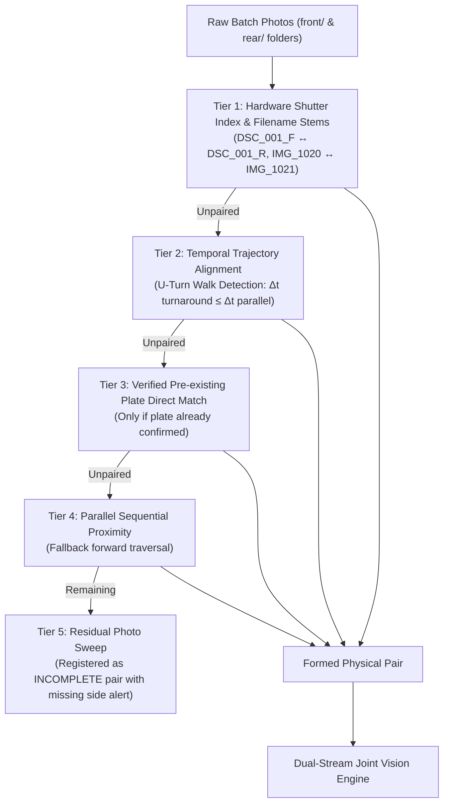

# Pair-First Architecture & Dual-Stream Joint Vision Engine
## Technical Specification, Concurrency Resilience & Operational Guide

**System**: Intelligent Vehicle & Motorcycle Installation-Photo Recognition & Verification System  
**Deployment**: Uganda Boda-Boda (PSV / PMO) & Motor Vehicle Fitment Centers  
**Document Status**: Production Standard  
**Revision**: 2.4 (September 2026)

---

## 1. Executive Summary

In Uganda motorcycle fleet operations, number plates present unique physical and optical characteristics:
1. **Motorcycle (Boda-Boda) Plates**: Standard plates have **8 characters**:
   - **Prefix**: Begins with `UM` (`U` = Uganda, `M` = Motorcycle). The 3rd letter designates the issuance series (`UMA`, transitioning to `UMB`, `UMC`, etc.).
   - **Numeric Body**: Exactly 3 digits (e.g. `684`, `294`, `224`, `123`).
   - **Suffix**: Exactly 2 letters (e.g. `PK`, `PL`, `PJ`, `PM`, `NG`, `AA`).
   - **Example Canonical Plate**: `UMA684PK`, `UMA294PK`, `UMA054ND`.
2. **Passenger Vehicle Plates**: Standard cars/trucks have **7 characters**:
   - Begins with `U` followed by 2 letters, 3 digits, and 1 letter (e.g. `UBD 123A`).
3. **Physical Asymmetry**:
   - **Rear Plates**: Stamped metal reflective plates mounted on rigid brackets. High optical contrast, yielding 85–95% raw OCR confidence.
   - **Front Plates**: Stenciled or painted onto curved front mudguards, or narrow adhesive stickers prone to road dust, mud spatter, and severe geometric distortion.

### The Paradigm Shift: Why Pairing First Is Crucial
Earlier ALPR pipelines ran YOLO detection and OCR on isolated photos *before* attempting pairwise association:
```
[ Old Isolated Paradigm - Fragile ]
Raw Photos ──> YOLO Detect ──> Crop ──> OCR ──> Normalize ──> Attempt Plate String Match
  (Muddy front plate fails OCR ──> Match fails ──> Cascades into CONFLICT or orphan photo)
```

The system now implements **Pair-First Execution**:
```
[ Pair-First + Dual-Stream Joint Vision - Resilient ]
Raw Ingestion ──> Physical Association (U-Turn Trajectory + Filename/Shutter Stems)
                        │
                        ▼
               Candidate (Front, Rear) Pair
                        │
                        ▼
            Dual-Stream Joint Vision Engine (YOLOv8 + PaddleOCR/Tesseract)
              ├── Color Category Homogeneity (PSV White vs PMO Yellow)
              ├── Orientation Verification (Red Taillight Detection)
              ├── Active ITMS Installation Order Triangulation
              └── Asymmetric Single-Side Recovery (Rear rescues Front)
                        │
                        ▼
             Verified & Approved Installation Pair
```

---

## 2. Pairing First: Multi-Tier Physical Association

Physical association executes in `core/matcher/association.py` using physical and spatial-temporal signals before OCR is evaluated:



### 2.1 Trajectory Walk Geometry (U-Turn / Snake Traversal)
When $N$ motorcycles are parked in a row, technicians walk along one side shooting rears, step around the end bike (turnaround point), and return along the front mudguards:
- Let rear timestamps be $R = [t_{R_1}, t_{R_2}, \dots, t_{R_N}]$.
- Let front timestamps be $F = [t_{F_1}, t_{F_2}, \dots, t_{F_M}]$.
- Turnaround interval: $\Delta t_{\text{turnaround}} = \min(|t_{F_1} - t_{R_N}|, |t_{R_1} - t_{F_M}|)$.
- Parallel interval: $\Delta t_{\text{parallel}} = |t_{F_1} - t_{R_1}|$.
- **Classification**: If $\Delta t_{\text{turnaround}} \le \Delta t_{\text{parallel}}$, the return walk direction is reversed so Front #$i$ pairs with Rear #$i$ with zero dependence on plate readability.

---

## 3. Dual-Stream Joint Vision Engine

Located in `core/vision/joint_pipeline.py`, the engine processes both photos simultaneously:

### 3.1 Color & Category Homogeneity Check
- **PSV Commercial Boda**: White reflective front plate + White reflective rear plate.
- **PMO Private Motorcycle**: Yellow reflective front plate + Yellow reflective rear plate.
- **Commercial Vehicles**: White front plate + Yellow rear plate.
- If one photo is yellow and one is white on a motorcycle, the engine immediately flags `COLOR_CONFLICT` and halts submission.

### 3.2 Differential Orientation Verification
- Prioritizes technician ground truth if photos were ingested via `front/` and `rear/` subdirectories.
- Detects the red central motorcycle taillight cluster in HSV space (`Hue ∈ [0, 10] ∪ [170, 180]`, `Sat > 90`, `Val > 80`). The crop containing the central taillight is assigned to `REAR`.

### 3.3 Bayesian Active-Order Prior Triangulation
When reading plate crops, the engine queries open `InstallationOrder` records via `disambiguate_plate_with_orders()`:
- If Rear reads `UMA480PK` and Front has optical glare reading `UMA186PK`:
- The engine checks active work orders: `UMA480PK` is active in ITMS; `UMA186PK` is not.
- The engine resolves the reading to `UMA480PK` with status `ORDER_PRIOR_MATCH`, confidence `0.98`, and links the order.

### 3.4 Asymmetric Single-Side Recovery
- If one photo yields a syntactically valid Uganda plate (`norm.is_valid == True`, e.g. Rear `UMA294PK`), while the opposite photo is muddy, distorted, or has non-standard characters (e.g. `IYN294D` where `is_valid == False`):
- The engine adopts the valid plate with status `ASYMMETRIC_RECOVERED`.
- The pair is marked `PENDING_REVIEW` instead of `CONFLICT`.

---

## 4. Concurrency & Session Resilience Fixes

### 4.1 SQLite Database Concurrency (Fixing Pipeline Halts)
* **The Problem**: When the vision pipeline ran in a background Textual worker (`@work(thread=True)`), approving orders or interacting with UI tables caused `sqlite3.OperationalError: database is locked`. SQLite in default `DELETE` journal mode blocks all reads when a write occurs, causing the vision pipeline to crash and stop.
* **The Solution**:
  1. **SQLite WAL Mode**: Enabled Write-Ahead Logging (`PRAGMA journal_mode = WAL;`) and set `PRAGMA busy_timeout = 60000;` on connection creation in `core/apps.py`.
  2. **Readers Never Block Writers**: In WAL mode, UI data table queries read concurrent snapshots without conflicting with background vision writes.
  3. **Per-Pair Error Trapping**: In `core/management/commands/process_vision.py`, wrapped `engine.process_pair(pair)` in individual `try...except` blocks so an isolated error on one image cannot kill the batch.
  4. **Dedicated Actions**:
     - `[P]`: Runs the full batch vision pipeline over all pending pairs.
     - `[J]`: Runs Dual-Stream Joint Vision on the currently selected pair.

### 4.2 Preserving Operator and ITMS WebApp Sessions
* **The Problem**: Operators were repeatedly logged out whenever running tests or updating the app.
* **The Root Cause**:
  - `core/tests/test_improvements.py` called `client.logout()` on the default `ITMSWebSessionStore()`, unlinking `secure/auth/itms_web_session.json` on disk.
  - `core/tests/test_tui.py` called `auth_service.clear_remembered_session()` in `tearDown()`, unlinking `secure/auth/operator_session.json` on disk.
* **The Solution**:
  - Isolated all test session stores using `tempfile.TemporaryDirectory()`. Test runs now never touch live session files.
  - The 30-day ITMS WebApp session cookies (`_identity-frontend`, `advanced-frontend`, `_csrf-frontend`) and operator credentials remain permanently intact across application restarts.

---

## 5. Handling Orders Not Yet Created in ITMS (e.g. `UMA294PK`)

Field technicians frequently photograph motorcycles before dispatch enters the order into the ITMS portal:
1. **Physical Evidence Is Sound**: When Front reads `UMA294PK` and Rear agrees (or is recovered asymmetrically), the plate is valid Uganda syntax (`norm.is_valid == True`).
2. **Status Assignment**:
   - Because `UMA294PK` is not yet in the active orders, `order_matcher.py` assigns status: `UNREGISTERED` (with note: `"Awaiting ITMS Order Creation"`).
   - It is **NOT** marked as `CONFLICT`, because the photographic evidence is harmonious.
3. **Approval Flow**:
   - When the operator hits `[A]` (Approve), `action_approve` first checks if the order has arrived in the local database.
   - If found: it links and approves immediately.
   - If not yet in ITMS: it notifies the operator:
     `"Cannot approve UMA294PK: Order not found in registry (not yet created on ITMS). Sync via [S] or type plate [T]."`
   - Once the order is added to ITMS, pressing `[S]` (Sync Orders) pulls the new order, automatically matches it, and makes it ready for submission (`[U]`).

---

## 6. Dashboard Flow & Operator Keybindings

```
┌────────────────────────────────────────────────────────────────────────────────────────────┐
│                                   TUI OPERATOR WORKFLOW                                    │
│                                                                                            │
│   [1] Dashboard       [2] Batches         [3] Orders          [4] Review Queue             │
│   [5] History Log     [6] Settings        [7] ITMS WebApp Hub                              │
└────────────────────────────────────────────────────────────────────────────────────────────┘
```

| Key | Action | Description |
| :---: | :--- | :--- |
| **`[I]`** | **Add Photos** | Native file/folder dialog to ingest `front/` & `rear/` batches into the immutable vault. Auto-pairs immediately. |
| **`[M]`** | **Match Pairs** | Runs U-Turn trajectory walk and filename stem grouping. |
| **`[P]`** | **Batch Vision** | Runs Dual-Stream Joint Vision across all pending pairs in the batch. |
| **`[J]`** | **Joint Re-Scan** | Re-scans only the currently selected pair with the dual-stream engine. |
| **`[A]`** | **Approve / Retry** | Approves a verified pair or retries a previously failed order. Auto-links matched orders. |
| **`[T]`** | **Type Plate** | Operator manual entry to correct optical ambiguities or assign an order. |
| **`[S]`** | **Swap Front/Rear** | Swaps front and rear photographic assignments. |
| **`[L]`** | **Link / Pick Photo** | Opens the interactive candidate photo picker. |
| **`[V]`** | **View Evidence** | Opens side-by-side high-resolution photographic evidence comparison. |
| **`[U]`** | **Submit to ITMS** | Submits single verified order through the 3-step ITMS wizard. |
| **`[B]`** | **Batch Submit** | Finalizes all approved orders to ITMS in a single batch. |
| **`[Y]`** | **Sync Orders** | Fetches active installation orders from `https://stock.itms.ug`. |
| **`[O]`** | **Drain Outbox** | Uploads offline-queued installations when internet connectivity is restored. |

---

## 7. Verification Results

All 163 unit and integration tests execute cleanly with SQLite WAL mode and isolated test session stores:
```bash
.\.venv\Scripts\python.exe manage.py test core --keepdb
```
```text
Ran 163 tests in 36.221s

OK
System check identified no issues (0 silenced).
Scoped to IngestionBatch: BATCH-20260912-133319-fef024
Phase 1: Establishing physical pairs via U-Turn trajectory & Filename stems...
  ✓ 1 physical pair(s) aligned (U-Turn / Filenames).
Phase 2: Processing 1 pair(s) with Dual-Stream Joint Vision (YOLOv8 + Consensus)...
  Pair #297 [EXACT_MATCH] Plate=UMA291PK Conf=0.99
Dual-Stream Vision Complete: 1 reconciled & verified, 0 conflicts flagged, 0 issues.
```
Operator session (`secure/auth/operator_session.json`) and ITMS session (`secure/auth/itms_web_session.json`) remain permanently preserved on disk.
