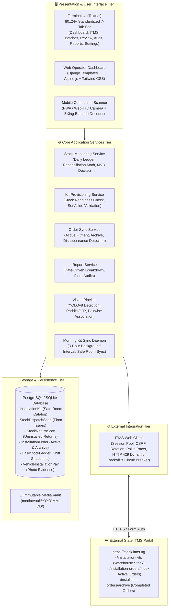
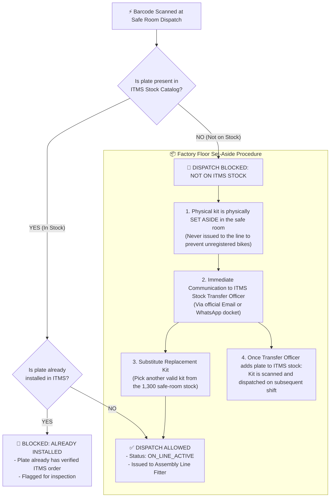
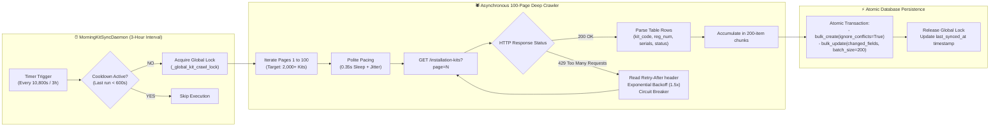
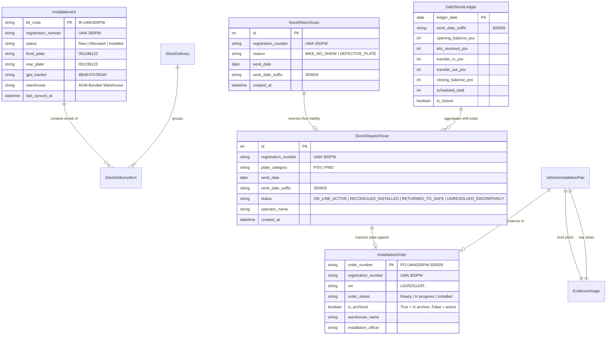

# System Architecture & Dataflow Specification

This document provides a comprehensive technical and operational architectural breakdown of the **ITMS Verification & Daily Stock Ledger System**. It details the dual-track lifecycle, end-to-end data pipelines, background synchronization daemons, database entity relationships, and mathematical reconciliation models governing high-security vehicle number plates and telematics kits at the assembly facility.

---

## 1. High-Level System Architecture

The application is structured as a decoupled, multi-tier operational control platform operating on local workstations with SQLite or PostgreSQL backends, synchronized asynchronously with the state ITMS (Intelligent Transport Management System) cloud portal.



---

## 2. Dual-Track Operational Architecture

The core operational principle strictly separates **Physical Safe Room Stock Control** from **Factory Floor Fitment & MVR Discrepancy Auditing**:

```text
┌────────────────────────────────────────────────────────────────────────────────────────┐
│ TRACK 1: PHYSICAL SAFE ROOM INVENTORY CONTROL (Physical Hardware)                      │
│ - Delivery Note Inbound Intakes (Supplier manifests into the bond safe room)           │
│ - Morning Shift Line Dispatches (Kits physically handed to fitters)                   │
│ - Evening Returns (Leftover uninstalled kits safely returned to safe room)             │
│ - Shift Closing Balance: Opening + Received + In - Out - Installed = Closing           │
└──────────────────────────────────────────┬─────────────────────────────────────────────┘
                                           │ Ground Truth Dispatches
                                           ▼
┌────────────────────────────────────────────────────────────────────────────────────────┐
│ TRACK 2: FACTORY FLOOR FITMENT & MVR EXCEPTION DOCKET (Digital Orders)                 │
│ - Motorcycle Assembly Line Fitting (Plates physically bolted onto bikes)               │
│ - ITMS Order Verification (MVR Officer creates order in ITMS)                          │
│ - Floor Discrepancy Detection: Dispatched − Returned − Archived − Active Orders        │
│ - Actionable MVR Exception Docket generation for 1-click clipboard allocation          │
└────────────────────────────────────────────────────────────────────────────────────────┘
```

> [!IMPORTANT]
> **Strict Isolation Rule**:
> Safe-room inventory sitting on warehouse shelves (`InstallationKit` with status `"New"`) belongs **exclusively** in the safe-room stock balance. It is **never** injected into the floor unallocated discrepancy table or the MVR Exception Docket. A kit is only audited for floor discrepancies after it has been physically scanned out of the safe room to the line (`StockDispatchScan`).

---

## 3. End-to-End Operational Lifecycle & Dataflow

The lifecycle of a high-security license plate follows five discrete operational stages from initial arrival to legally defensible closing sign-off:

```mermaid
sequenceDiagram
    autonumber
    actor Supplier as Supplier / Depot
    actor SafeKeeper as Safe Room Keeper
    actor Fitter as Assembly Line Fitter
    actor MVROfficer as MVR ITMS Officer
    participant App as ITMS Verification Copilot
    participant ITMS as ITMS Cloud Portal

    Note over Supplier,SafeKeeper: STAGE 1: INBOUND INTAKE
    Supplier->>SafeKeeper: Delivers physical kits + Paper Delivery Note (e.g., DN-88492)
    SafeKeeper->>App: Scans delivery items via Barcode Wedge / Mobile Camera
    App->>App: Generates DN-YYYYMMDD-01, records StockDeliveryItem, updates Safe Room balance

    Note over SafeKeeper,Fitter: STAGE 2: MORNING LINE DISPATCH & PRE-CHECK
    Fitter->>SafeKeeper: Requests kits for shift (e.g., 500 kits)
    SafeKeeper->>App: Scans kits out to line (StockDispatchScan)
    App->>App: Pre-check: Is kit registered on ITMS stock?
    alt Kit is NOT on ITMS Stock
        App-->>SafeKeeper: ⚠️ BLOCKED: Set Aside Workflow Triggered!
        Note over SafeKeeper: Plate put aside in safe room; email/WhatsApp to Stock Officer; replaced with valid kit
    else Kit is Valid on ITMS Stock
        App->>App: Records StockDispatchScan(status='ON_LINE_ACTIVE')
    end

    Note over Fitter,MVROfficer: STAGE 3: ASSEMBLY FITMENT & ORDER CREATION
    Fitter->>Fitter: Bolts front & rear plates, mounts GPS tracker onto bike
    Fitter->>App: Photo capture of bike (front plate + rear plate)
    MVROfficer->>ITMS: Types plate number & creates installation order

    Note over SafeKeeper,App: STAGE 4: EVENING RETURNS
    Fitter->>SafeKeeper: Returns uninstalled kits (e.g., 100 bike no-shows)
    SafeKeeper->>App: Scans returns (StockReturnScan)
    App->>App: Updates StockDispatchScan to 'RETURNED_TO_SAFE', restores Safe Room count

    Note over App,MVROfficer: STAGE 5: ELIMINATION AUDIT & DOCKET GENERATION
    App->>ITMS: Background sync fetches Today Active Orders & Today Archive
    App->>App: Runs Daily Elimination Math: Dispatched - Returned - Archived - Active
    alt Discrepancy Found (Dispatched but No Order in ITMS)
        App->>App: Flags plate as UNRESOLVED_DISCREPANCY
        App->>SafeKeeper: Displays MVR Allocation Exception Docket
        SafeKeeper->>MVROfficer: Hands over Docket / 1-click Raw Plates
        MVROfficer->>ITMS: Allocates missing plates in ITMS
        App->>App: Next sync detects order -> Discrepancy self-heals to 0!
    end
```

---

## 4. The "Set Aside" Pre-Dispatch Verification Workflow

When an operator scans plates during morning dispatch, each barcode is validated against the safe room's synchronized ITMS catalog. If a physical kit is discovered that has not yet been registered in the national stock system by the ITMS Stock Transfer Officer:



---

## 5. Mathematical Reconciliation Engine

The system computes two independent mathematical ledgers for every shift date:

### 5.1 Safe Room Physical Balance Equation

Tracks physical inventory residing within the bonded safe room:

$$\mathbf{Closing\ Balance} = \text{Opening} + \text{Received} + \text{Transfer In} - \text{Transfer Out} - \text{Installed} - \text{Defective}$$

* **Opening Balance**: Final closing count of previous shift.
* **Received**: Sum of all plates checked in via Supplier Delivery Notes (`StockDeliveryItem`).
* **Transfer In / Out**: Stock transferred between bonded facilities (e.g., AGM $\leftrightarrow$ SPIRO).
* **Installed**: Plates confirmed archived or installed in ITMS for that shift.
* **Closing Balance**: Physical hardware remaining under lock in the safe room.

### 5.2 Factory Floor Elimination Audit (MVR Discrepancy Scale)

Identifies plates that left the safe room but were skipped during digital order creation:

$$\mathbf{Net\ Physically\ on\ Line} = \text{Dispatched Scans} - \text{Returned Scans}$$

$$\mathbf{Unallocated\ Floor\ Discrepancy} = \mathbf{Net\ Physically\ on\ Line} - \text{ITMS Archived Orders} - \text{ITMS Active Orders}$$

#### The Graduated Discrepancy Audit Scale

| Tier | Status Key | Status Label | Operational Meaning | Action Required |
| :---: | :--- | :--- | :--- | :--- |
| 🟢 | `RECONCILED_INSTALLED` | Reconciled Installed | Plate dispatched and confirmed in ITMS Archive or status `"Installed"`. | None (Reconciled) |
| 🟢 | `RETURNED_TO_SAFE` | Returned to Safe Room | Plate returned uninstalled via evening return scan (`StockReturnScan`). | Restored to Safe Room |
| 🟡 | `ON_LINE_ACTIVE` | On-Line Active in ITMS | Plate dispatched; order currently in progress in ITMS active queue. | Normal Installation |
| 🔴 | `UNRESOLVED_DISCREPANCY` | Floor Unallocated Kit | Plate dispatched to line, **not returned**, and **no order exists in ITMS**. | **MVR Officer must immediately search & allocate kit** |

> [!NOTE]
> **Vision OCR Elimination**: Earlier revisions queried camera OCR text fragments (`EvidenceImage`) for discrepancy calculations. This caused partial plate misreads and OCR noise to pollute stock reports. The reconciliation engine now relies **strictly on physical barcode/plate scans**, guaranteeing zero OCR false positives in stock ledgers.

---

## 6. High-Capacity Background Crawler & Synchronization Engine

To ensure the local database reflects up to the minute warehouse catalog changes across high-volume facilities, the crawler subsystem implements rate-limiting protections and asynchronous background processing.



### Rate Limiting & Safety Guardrails

1. **Global Concurrency Lock (`_global_kit_crawl_lock`)**: Prevents overlapping crawl workers if the TUI, Web Console, and background daemon fire simultaneously.
2. **Polite Pacing**: Injects a minimum `0.35s` sleep with random jitter between page requests to maintain low server load on `stock.itms.ug`.
3. **HTTP 429 Dynamic Backoff**: Parses `Retry-After` headers; automatically backs off dynamically if the remote server throttles requests.
4. **Consecutive Error Circuit Breaker**: Aborts the crawl run if 3 consecutive non-recoverable network errors occur, preventing runaway retry storms.
5. **Atomic Chunked Bulk Upserts**: Replaces single row-by-row queries with atomic `bulk_create` and `bulk_update` in chunks of 200 items, preventing SQLite/PostgreSQL table locking.

---

## 7. Data Models & Entity Relationship Diagram



---

## 8. User Interface Integration & Navigation Reference

The data and reconciliation state are rendered consistently across both the Terminal UI and Web interfaces:

### Terminal User Interface (TUI) Tabs

| Tab Number | Title | Purpose & Operational Binding |
| :---: | :--- | :--- |
| `[1]` | `DASHBOARD` | High-level system vitals, active fitment stream, and daily targets. |
| `[2]` | `ITMS` | Live ITMS connection status, active orders, archive, and installation kits catalog. |
| `[3]` | `BATCHES` | Ingestion batch management, vault image import, and camera session alignment. |
| `[4]` | `REVIEW` | Vehicle photo pair verification queue (`[A]` Approve, `[T]` Match, `[S]` Swap, `[L]` Pick). |
| `[5]` | `AUDIT` | Append-only audit logs, inspection history, and operator overrides. |
| `[6]` | `REPORTS` | **Date-driven shift reports**, Safe Room Ledger, **⚠️ Floor Unallocated Plates Audit**, and 1-click MVR Docket export. |
| `[7]` | `SETTINGS` | System configuration, YOLO weight selection, and directory pickers. |

### Global Shortcut Keys

* `[K]`: Open **Stock & Bond Manager Modal** (Intake delivery notes, morning dispatches, evening returns, stocktaking).
* `[D]`: Cycle active **Date Scope** (e.g., switch between `300926`, `021026`, and `ALL`).
* `[Ctrl+P]`: Open the **Central Command Palette** for quick access to all subsystem operations.
* `[Y]`: Force synchronous ITMS orders and archive update.

---

## 9. Verification & Health Monitoring

To verify system consistency or execute manual audits:

```bash
# 1. Run full test suite covering reports and stock reconciliation
python manage.py test core.tests.test_reports_and_lifecycle core.tests.test_stock_monitoring

# 2. Check diagnostic health status
itms status

# 3. Synchronize installation kits up to 100 pages manually
python manage.py sync_stock_kits --pages 100

# 4. Generate daily shift audit CSV export
python manage.py reconcile_shift --date today
```
